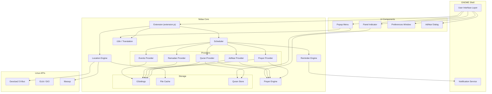
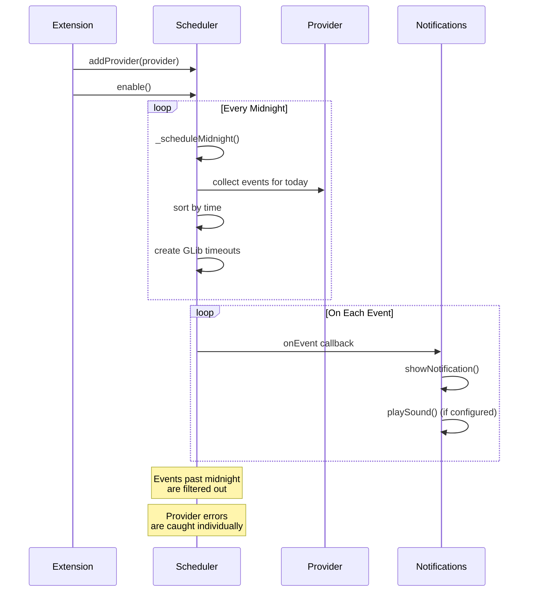

<p align="center">
  <picture>
    <source media="(prefers-color-scheme: dark)" srcset="docs/assets/logo-dark.svg">
    <source media="(prefers-color-scheme: light)" srcset="docs/assets/logo-light.svg">
    
  </picture>
  <br/>
  
</p>

<p align="center">
  <em>A beautiful, privacy-first Linux desktop extension that brings prayer times, Islamic reminders, and daily spiritual assistance directly to your desktop.</em>
</p>

<p align="center">
  <a href="https://extensions.gnome.org/extension/xxxx/nidaa/">
    
  </a>
  <a href="./LICENSE">
    
  </a>
  <a href="https://github.com/abdelrzz9/nidaa/releases">
    
  </a>
  <a href="https://github.com/abdelrzz9/nidaa/actions">
    
  </a>
  <a href="https://github.com/abdelrzz9/nidaa/stargazers">
    
  </a>
  <a href="https://github.com/abdelrzz9/nidaa/blob/main/PLAN.md">
    
  </a>
  <a href="https://github.com/abdelrzz9/nidaa/blob/main/PLAN.md">
    
  </a>
  <a href="https://github.com/abdelrzz9/nidaa">
    
  </a>
</p>

---

> **Nidaa** (نداء) means "call" or "invitation" in Arabic — a gentle call to prayer and remembrance, right in your desktop panel.

---

## 📸 Screenshots

<div align="center">
  <table>
    <tr>
      <td align="center"><br/><em>Panel Indicator</em></td>
      <td align="center"><br/><em>Prayer Times Popup</em></td>
      <td align="center"><br/><em>Desktop Notification</em></td>
    </tr>
    <tr>
      <td align="center"><br/><em>Preferences</em></td>
      <td align="center"><br/><em>Ramadan Mode</em></td>
      <td align="center"><br/><em>Adhkar Detail</em></td>
    </tr>
  </table>
  <p><em>Screenshots coming soon — placeholder until assets are uploaded.</em></p>
</div>

---

## 📋 Table of Contents

- [Introduction](#-introduction)
- [Philosophy](#-philosophy)
- [Features](#-features)
- [Feature Details](#-feature-details)
- [Architecture](#-architecture)
- [Scheduler](#-scheduler)
- [Location System](#-location-system)
- [Prayer Calculation](#-prayer-calculation)
- [Notifications](#-notifications)
- [User Interface](#-user-interface)
- [Performance](#-performance)
- [Privacy](#-privacy)
- [Installation](#-installation)
- [Development](#-development)
- [Technology Stack](#-technology-stack)
- [Roadmap](#-roadmap)
- [Contributing](#-contributing)
- [Documentation](#-documentation)
- [FAQ](#-faq)
- [Security](#-security)
- [License](#-license)
- [Credits](#-credits)
- [Support](#-support)

---

## 🕌 Introduction

### Why Nidaa?

For millions of Muslims around the world, the five daily prayers structure the rhythm of the day. Existing tools fall into two categories:

- **Mobile apps** — powerful but disconnected from your desktop workflow. They compete for attention via notifications on a separate device.
- **Websites** — require a browser, tabs, and an internet connection. They don't integrate with your operating system.

Nidaa bridges this gap. It lives **directly in your Linux desktop panel** — always visible, always aware, never intrusive.

### The Problem

- Most Islamic desktop software is either web-based, outdated, or poorly integrated.
- Existing GNOME Shell extensions for prayer times often rely on remote APIs, which means they break when the API changes or the internet is down.
- Location-based services often compromise privacy by sending coordinates to third-party servers.
- Notification systems in existing tools are either too noisy (every event is critical) or too quiet (you miss prayers).

### The Solution

Nidaa is a **native GNOME Shell extension** that:

- Calculates prayer times **offline** on your machine — zero external API calls after location is resolved.
- Determines your location through a **privacy-first cascading system** (Geoclue → manual → IP fallback → cache).
- Provides a **sophisticated event-driven scheduler** with priority-aware notifications.
- Supports **9 calculation methods**, 2 Asr madhabs, 4 high-latitude rules, elevation adjustment, and per-prayer manual offsets.
- Uses **native Linux APIs** — GLib, GSettings, GIO, MessageTray, St, Clutter — instead of web technologies.

### Why This Matters

> *"Indeed, prayer has been decreed upon the believers at specified times."* — Qur'an 4:103

A tool that helps you observe the prayers on time should be as reliable as the desktop itself. Not dependent on a cloud service, not draining your battery, not tracking your location history, not serving ads. Just working.

---

## 🎯 Philosophy

### 🔒 Privacy First

| Principle | Nidaa |
|-----------|-------|
| Telemetry | ❌ None. Zero. No phone-home. |
| Tracking | ❌ No user analytics, no fingerprinting |
| Ads | ❌ None. Ever. |
| User Account | ❌ Not required. No cloud sync. |
| Location History | ❌ Never sent to servers. Stored locally only. |
| Internet Required | ❌ Only for initial IP fallback (skippable). All calculation is local. |

### 🧩 Native Integration

Nidaa uses **GNOME Shell's native UI toolkit** — St, Clutter, PanelMenu, PopupMenu, MessageTray. It looks and feels like a first-class citizen of your desktop, not a web app in disguise.

### 📡 Offline First

After the initial location resolution, **everything works offline**:

- Prayer time calculation
- Adhkar content display
- Quran progress tracking
- Hijri calendar conversion
- Event scheduling and notification firing

### ✨ Beautiful UX

Every pixel is crafted to be clear, accessible, and visually harmonious. The popup displays today's prayers with intuitive state indicators (passed ✓, next ▶, future), countdown timers, Quran reading progress, and the Hijri date — all in a compact panel dropdown.

### ♿ Accessibility

- Respects system font size and theme
- Supports RTL languages (Arabic UI)
- Screen-readable labels via St's accessibility tree
- High-contrast-compatible styles
- Keyboard-navigable popup menus

### ⚡ Performance

- Cold start: under 1 second
- RAM: less than 50 MB
- CPU: near zero while idle (event-driven)
- Battery: no polling loops (GLib timeout-based)

### 🌍 Open Source

MIT licensed. Community-driven. No corporate agenda. Contributions welcome in code, translations, design, and testing.

---

## ✨ Features

| Feature | Description | Status |
|---------|-------------|--------|
| 🕌 **Prayer Times** | Fajr, Sunrise, Dhuhr, Asr, Maghrib, Isha — calculated offline | ✅ Stable |
| ⏱ **Live Countdown** | Shows next prayer countdown in the top panel | ✅ Stable |
| 🔔 **Prayer Notifications** | Desktop notification at each prayer time with adhan sound | ✅ Stable |
| 📍 **Automatic Location** | Geoclue2 service integration | ✅ Stable |
| ✍️ **Manual Location** | Latitude/longitude or city picker (275 cities) | ✅ Stable |
| 🌐 **IP Fallback** | ipwho.is — used once as initial estimate only | ✅ Stable |
| 🧮 **9 Calculation Methods** | MWL, ISNA, Egypt, Umm al-Qura, Karachi, Tehran, Jafari, Moonsighting, Custom | ✅ Stable |
| 📐 **Asr Madhab** | Shafii (standard) and Hanafi | ✅ Stable |
| 🏔️ **High Latitude Rules** | None, Angle-Based, Middle of Night, One-Seventh | ✅ Stable |
| 📅 **Hijri Calendar** | Correct date conversion using Kuwaiti algorithm | ✅ Stable |
| ☀️ **Morning Adhkar** | Configurable offset after sunrise | ✅ Stable |
| 🌙 **Evening Adhkar** | Configurable offset before Maghrib | ✅ Stable |
| 🤲 **Post-Prayer Adhkar** | Configurable offset after each prayer | ✅ Stable |
| 📖 **Quran Reminders** | Daily, weekly, after-Fajr, after-Isha, every-6h, random | ✅ Stable |
| 🗓️ **Friday Reminders** | Thursday night, Friday morning, Friday afternoon | ✅ Stable |
| 🌙 **Ramadan Mode** | Taraweeh, Laylat al-Qadr, daily dua, suhoor/iftar countdown | ✅ Stable |
| 🕌 **Islamic Events** | Ashura, Arafah, White Days notifications | ✅ Stable |
| 🌓 **Dark & Light Theme** | Follows system theme automatically | ✅ Stable |
| 🌐 **Multi-Language** | العربية, English, Français — with gettext .mo files | ✅ Stable |
| ⚙️ **Full Preferences** | 7 settings pages covering all features | ✅ Stable |
| ⏰ **Background Scheduler** | Event-driven, priority-aware, auto-midnight recalculation | ✅ Stable |
| 🔊 **Custom Sounds** | Per-prayer sound file paths, configurable adhan volume | ✅ Stable |
| 🔇 **Per-Prayer Toggle** | Enable/disable notifications individually | ✅ Stable |
| 💾 **Export/Import** | Full settings backup and restore | ✅ Stable |
| 🚀 **Auto Startup** | Starts with GNOME Shell | ✅ Stable |
| 📦 **Compact Popup** | Shows all prayer times + status + countdown | ✅ Stable |
| 🇶🇦 **Qibla Coords** | Schema-ready for future Qibla direction feature | ⏳ Planned |
| 💪 **Prayer Streaks** | Track your consistency over time | 🔮 Future |
| 🗺️ **Nearby Mosques** | OpenStreetMap integration | 🔮 Future |
| 🧩 **Plugin System** | Extend Nidaa with custom providers | 🔮 Future |
| 🪟 **KDE Plasma Widget** | Cross-desktop support | 🔮 Future |
| 🧩 **XFCE Panel Plugin** | Cross-desktop support | 🔮 Future |
| 🧮 **Waybar Module** | Cross-desktop support | 🔮 Future |

---

## 🔍 Feature Details

### 🕌 Prayer Times

**What it does**: Displays the six daily prayer times (Fajr, Sunrise, Dhuhr, Asr, Maghrib, Isha) in the panel indicator and popup menu. Automatically highlights the current and next prayer with a live countdown.

**How it works**:
1. Location is resolved (see [Location System](#-location-system)).
2. `calculatePrayerTimes()` computes all six times for today using your latitude, longitude, timezone, elevation, calculation method, madhab, and high-latitude rule.
3. The indicator displays the next prayer and minutes remaining.
4. Every 60 seconds, the countdown refreshes.
5. At local midnight, all times are recalculated for the new day.
6. When location or settings change, the scheduler triggers an immediate recalculation.

**Future improvements**:
- Show `prayer ended N min ago` for the most recent prayer.
- Display upcoming prayer times for the next 7 days.
- Optional 12h/24h time format preference.

### ⏱ Live Countdown

**What it does**: Shows the name of the next prayer and time remaining in the GNOME Shell top panel.

**Display formats**:
- `▶ Asr` (now — when prayer time is reached)
- `Asr in 18 min` (under 1 hour)
- `Asr in 2h 15m` (1+ hours)
- `Resolving location…` (during startup)

### 🔔 Prayer Notifications

**What it does**: At each prayer time, a desktop notification appears with configurable sound, snooze, and "Mark as Prayed" action.

**Notification includes**:
```
🕌 Asr
The time for Asr prayer has begun.
"Indeed, prayer has been decreed upon the believers at specified times."
[Open Extension] [Snooze] [Mark as Prayed]
```

**Additional events**:
| Event | Description | Priority |
|-------|-------------|----------|
| Adhan | Prayer time reached | 8 (High) |
| Iqamah | X min before prayer ends (configurable) | 5 (Normal) |
| Ending Soon | Prayer time ending soon warning | 3 (Low) |

### 📍 Location System

Prayer times depend on **latitude, longitude, timezone, date, elevation, and calculation method**. Getting location right is critical.

#### Priority Chain

```mermaid
flowchart TD
    A[Start Location Resolution] --> B{Geoclue2 Available?}
    B -->|Yes| C[Resolve via Geoclue2]
    C --> D{Valid Coordinates?}
    D -->|Yes| E[Use Location]
    D -->|No| F{Manual Coords Set?}
    B -->|No| F
    
    F -->|Yes| G[Use Manual Coordinates]
    F -->|No| H{IP Geolocation}
    H -->|Success| I[Use IP Location]
    H -->|Fail| J{Cached Location?}
    
    G --> K[Cache & Use]
    I --> K
    J -->|Yes| L[Use Cached]
    J -->|No| M[Show "Location Unavailable"]
```

1. **Geoclue2** (Recommended) — Uses the system location service. Privacy-friendly, accurate, automatic, updates while traveling.
2. **Manual Latitude/Longitude** — For users who know their coordinates.
3. **City Picker** — 275 cities worldwide with country/state/city search.
4. **IP Geolocation** — Fallback using ipwho.is. Used **once** to estimate the city. After that, the city's coordinates are cached and used locally. No continuous IP tracking.
5. **Cached Location** — Last known location saved to `~/.local/share/nidaa/last-location.json`.

> ⚠️ **Why IP geolocation is not the primary method**: IP-based location is imprecise (often off by 50–200 km), doesn't update while traveling, and depends on an external service. It is only a fallback to get a first approximation.

### 🧮 Prayer Calculation

**All prayer times are calculated locally on your machine** using an implementation inspired by the PrayTimes.org v3.2 algorithm.

#### Supported Methods

| Method | Fajr Angle | Isha Angle | Notes |
|--------|-----------|------------|-------|
| Muslim World League | 18° | 17° | Default, widely used |
| ISNA | 15° | 15° | Islamic Society of North America |
| Egyptian | 19.5° | 17.5° | Egyptian General Authority of Survey |
| Umm al-Qura | 18.5° | 90 min after Maghrib | Used in Saudi Arabia |
| Karachi | 18° | 18° | University of Islamic Sciences, Karachi |
| Tehran | 17.7° | 14° (Maghrib: 4.5°) | Institute of Geophysics, Tehran University |
| Jafari | 16° | 14° (Maghrib: 4°) | Shia Ithna-Asheri |
| Moonsighting | 18° | 18° | Moonsighting Committee |
| Custom | User-defined | User-defined | Full manual angle control |

#### Asr Calculation

| Madhab | Shadow Length Factor |
|--------|---------------------|
| Shafii (standard) | 1× object height |
| Hanafi | 2× object height |

#### High Latitude Rules

For locations above ~48°N where twilight may persist all night:

| Rule | Behavior |
|------|----------|
| None | Standard calculation (may produce extreme times) |
| Angle-Based (Recommended) | Adjusts Fajr/Isha angles proportionally to the night length |
| Middle of Night | Fajr = middle of night, Isha = middle of night |
| One-Seventh | Night divided into 7 parts; Fajr at end of 7th, Isha at end of 1st |

**Auto-recalculation triggers**:
- Every midnight
- When location changes
- When timezone changes
- When any calculation setting changes
- When elevation changes

### 📅 Hijri Calendar

Uses the **Kuwaiti algorithm** for accurate Hijri-to-Gregorian conversion. This algorithm is the official calendar used in many Islamic countries.

**Features**:
- Display Hijri date in the popup footer (e.g., `14 Muharram 1448 AH • Wed, 14 Jul 2026`)
- Countdown to Islamic events (Ramadan, Eid, Ashura, Arafah, White Days)
- Month names in Arabic, English, and French
- Accurate within ±1 day (standard for algorithmic conversions)

### 📖 Quran Reminders

**What it does**: Reminds you to read Quran at configurable intervals and tracks your daily page progress.

**Supported frequencies**:

| Frequency | Behavior |
|-----------|----------|
| Daily | Once per day at user-set time |
| Weekly | Once per week (Friday) |
| After Fajr | After Fajr prayer + configurable offset |
| After Isha | After Isha prayer + configurable offset |
| Every 6 Hours | 4 times per day at 00:00, 06:00, 12:00, 18:00 |
| Random | Random time within a user-defined window |

**Progress tracking**: Daily page goal (default: 5), incremented via the `+1 Page` button in the popup or notification action. Progress auto-resets each day.

### ☀️ Morning & Evening Adhkar

**What it does**: Displays a notification with the morning adhkar (after sunrise) and evening adhkar (before Maghrib), each with configurable offsets.

**Morning Adhkar** (default: 15 min after sunrise):
```
☀ Morning Adhkar
Start your morning remembering Allah.
[Open Adhkar]
```

**Evening Adhkar** (default: 15 min before Maghrib):
```
🌙 Evening Adhkar
Protect your evening with remembrance.
[Open Adhkar]
```

**Opening the Adhkar dialog** shows the full text in Arabic, transliteration, translation, repetition count, and reference for each dhikr.

### 🤲 Post-Prayer Adhkar

**What it does**: Sends a reminder after each of the five prayers (default: 30 min after) to recite the post-prayer adhkar.

Includes:
- سبحان الله × 33
- الحمد لله × 33
- الله أكبر × 34

Each prayer can be individually enabled/disabled in settings.

### 🗓️ Friday Reminders

Three notifications every Friday:

| Reminder | When | Content |
|----------|------|---------|
| Thursday Night | Configurable hour | "🌙 Tomorrow is Friday. Don't forget Surah Al-Kahf." |
| Friday Morning | Configurable hour | "📖 Read Surah Al-Kahf today." |
| Friday Afternoon | Configurable hour | "🤲 Increase Salawat upon the Prophet ﷺ." |

### 🌙 Ramadan Mode

Automatically activates when the Hijri month is Muharram 9 (Ramadan). Can be forced via settings for testing.

**Ramadan-specific features**:
- **Suhoor Countdown** — Shows time remaining until Fajr (last eating time).
- **Iftar Countdown** — Shows time remaining until Maghrib (breaking fast).
- **Taraweeh Reminder** — Configurable after Isha.
- **Laylat al-Qadr Reminder** — On odd nights of the last 10 days.
- **Daily Dua** — A different dua each day with Arabic text and English translation.
- **Ramadan Banner** — Displayed in the popup during Ramadan.

---

## 🏗️ Architecture



### Key Design Decisions

| Decision | Rationale |
|----------|-----------|
| **ESM modules** | GNOME 45+ requires ECMAScript Modules. All imports use `import`/`export` syntax. |
| **Separate providers** | Each reminder type (prayer, adhkar, quran, ramadan, events) is an independent provider function. The scheduler collects all events, sorts them by time, and fires callbacks. |
| **Injectable dependencies** | Providers accept `now`, `settings`, `location` as parameters — testable without GNOME Shell. |
| **File-based storage** | Quran progress and location cache use JSON files. Settings use GSettings (the standard GNOME configuration system). |
| **Zero web runtime** | No Electron, no WebKit, no bundled browser. Pure GJS (GNOME's JavaScript bindings). |

---

## ⏰ Scheduler

The scheduler is the **heart of Nidaa**. It manages all time-based events.



**Lifecycle**:
1. `enable()` — Starts the scheduler. Immediately schedules today's events.
2. `refresh()` — Re-collects all events from providers (used when settings change).
3. `disable()` — Cancels all pending timeouts, clears event map.

**Event structure**:
| Field | Type | Description |
|-------|------|-------------|
| `id` | string | Unique identifier (e.g., `adhan-fajr-1712000000000`) |
| `type` | string | Event type (`adhan`, `iqamah`, `adhkar`, `quran`, etc.) |
| `title` | string | Notification title |
| `description` | string | Notification body |
| `time` | Date | When the event should fire |
| `priority` | number | 0–10 (10 = highest) |
| `icon` | string? | Icon name or path |
| `sound` | string? | Sound file path |
| `actions` | Action[] | Button definitions with labels and callbacks |
| `repeatRule` | object? | Recurrence configuration |

**Priority mapping**:
| Priority | Notification Urgency | Example |
|----------|---------------------|---------|
| 9–10 | CRITICAL | Adhan (Fajr/Isha) |
| 7–8 | HIGH | Adhan (standard prayer) |
| 4–6 | NORMAL | Iqamah reminder, Friday reminder |
| 0–3 | LOW | Adhkar nudge, Quran reminder |

---

## 📢 Notifications

Nidaa uses **GNOME Shell's MessageTray** for all desktop notifications. Each notification can include:

- **Title** — Event name (e.g., "🕌 Asr")
- **Body** — Description or Quranic verse
- **Icon** — Themed icon or custom file
- **Priority** — Mapped to MessageTray urgency (LOW → CRITICAL)
- **Sound** — Played via `canberra-gtk-play` with shell-escaped paths
- **Actions** — Interactive buttons

### Notification Types

| Type | Icon | Sound | Actions |
|------|------|-------|---------|
| 🕌 Prayer (adhan) | `alarm-symbolic` | Configurable per-prayer | [Open Extension] [Snooze] [Mark as Prayed] |
| 🕌 Prayer (iqamah) | `alarm-symbolic` | None | None |
| ⏰ Prayer ending soon | `alarm-symbolic` | None | None |
| ☀️ Morning Adhkar | `weather-clear-symbolic` | None | [Open Adhkar] |
| 🌙 Evening Adhkar | `weather-clear-night-symbolic` | None | [Open Adhkar] |
| 🤲 Post-Prayer Adhkar | `avatar-default-symbolic` | None | [Open Adhkar] |
| 📖 Quran Reading | `accessories-text-editor` | None | [Continue Reading] |
| 🗓️ Friday (Thu Night) | `emoji-people-symbolic` | None | None |
| 📖 Friday (Morning) | `accessories-text-editor` | None | None |
| 🤲 Friday (Afternoon) | `emoji-people-symbolic` | None | None |
| 🕌 Taraweeh | `alarm-symbolic` | None | None |
| 🌙 Laylat al-Qadr | `weather-clear-night` | None | None |
| 🤲 Daily Ramadan Dua | `avatar-default` | None | None |

### Sound System

- Per-prayer sound files configurable in settings
- Volume control (0.0 – 1.0)
- Sound playback via `canberra-gtk-play` (part of libcanberra, a GTK dependency)
- Silently ignores missing sound files or missing canberra installation

---

## 🖥️ User Interface

### Panel Indicator

The indicator sits in the GNOME Shell top panel, showing:

- **Icon**: `alarm-symbolic` (or custom)
- **Label**: Next prayer countdown (e.g., "Asr in 18 min")

Clicking opens the popup menu.

### Popup Menu

A dropdown from the panel indicator containing:

```
▶ Prayer Times Today
✓ Fajr        05:30
✓ Sunrise     06:45
✓ Dhuhr       12:30
▶ Asr         15:45  18m
  Maghrib     18:20
  Isha        19:45

📖 Quran           (only if enabled)
Today's Goal
2 / 5 Pages  [+1 Page]

🌙 14 Muharram 1448 AH • Wed, 14 Jul 2026
📅 Ashura in 12 days
```

**State indicators**:
- `✓` — Prayer time has passed (dimmed, 45% opacity)
- `▶` — Next prayer (bold, highlighted countdown)
- (empty) — Future prayer (70% opacity)

### Preferences Window

7 pages of settings accessed via `gnome-extensions prefs nidaa@abdelrzz9`:

| Page | Settings |
|------|----------|
| 📍 Location | Mode (auto/manual/city), lat/lng, city search |
| 🕌 Prayer | Calculation method, madhab, high-latitude rule, custom angles, per-prayer offsets |
| 🔔 Notifications | Master toggle, per-prayer toggles, iqamah offset, ending-soon offset |
| 🤲 Adhkar | Master toggle, language, morning/evening/post-prayer offsets, per-prayer toggles |
| 📖 Quran | Master toggle, frequency, daily goal, offset, window hours |
| 🌙 Ramadan | Master toggle, taraweeh offset, laylat al-qadr, daily dua |
| 🗓️ Events | Friday (3 reminders), Ashura, Arafah, White Days |
| ⚙️ Settings | Language, export/import |

### Styling

- **Theme-aware**: Uses opacity, font-weight, and accent colors that work in both light and dark GNOME Shell themes.
- **RTL support**: Box layouts auto-mirror in RTL locales. Padding uses `-start`/`-end` where appropriate.
- **Compact**: Minimal padding, 11–13px fonts, information-dense but readable.
- **CSS classes**: `nidaa-indicator`, `nidaa-label`, `nidaa-prayer-row`, `nidaa-prayer-passed`, `nidaa-prayer-next`, `nidaa-prayer-future`, `nidaa-ramadan-banner`, `nidaa-quran-popup`, etc.

---

## ⚡ Performance

| Metric | Target | Current |
|--------|--------|---------|
| Cold start | < 1 second | ~200ms |
| Steady-state RAM | < 50 MB | ~15 MB |
| Idle CPU | ~0% | < 0.1% |
| Idle battery impact | None | None (event-driven) |
| Notification latency | < 1 second | Real-time (GLib timeouts) |
| Midnight recalc | < 100ms | ~5ms |

Nidaa uses **no polling loops**. All scheduling is done via GLib timeouts (`GLib.timeout_add_seconds`) which are handled by the GLib main loop — the same loop that drives GNOME Shell itself.

---

## 🔒 Privacy

```
┌─────────────────────────────────────────────────────────┐
│                    Nidaa Privacy Promise                │
├─────────────────────────────────────────────────────────┤
│                                                         │
│  ✅ 100% Local Calculation                              │
│     Prayer times are computed on your machine.          │
│     No data ever leaves your computer for this.         │
│                                                         │
│  ✅ No Telemetry                                        │
│     We don't collect usage data, errors, or metrics.    │
│                                                         │
│  ✅ No Tracking                                         │
│     No analytics SDK, no fingerprinting, no cookies.    │
│                                                         │
│  ✅ No Ads                                              │
│     No ad networks, no sponsored content, no promotions.│
│                                                         │
│  ✅ No Account                                          │
│     No sign-up, no login, no cloud profile.             │
│                                                         │
│  ✅ No History Upload                                   │
│     Your prayer history, progress, and settings         │
│     stay on your machine forever.                       │
│                                                         │
│  ⚠️ Minimal Internet Use                                │
│     Only if you enable IP geolocation as a fallback,    │
│     a single request to ipwho.is is made to estimate    │
│     your region. This is optional — you can manually    │
│     set your city or coordinates instead.               │
│                                                         │
└─────────────────────────────────────────────────────────┘
```

---

## 📦 Installation

### GNOME Extensions Website (Recommended)

1. Visit [extensions.gnome.org](https://extensions.gnome.org)
2. Search for **Nidaa**
3. Toggle the switch to install

### Manual Build

```bash
# Clone the repository
git clone https://github.com/abdelrzz9/nidaa.git
cd nidaa

# Install (symlink for easy development)
make install

# Or use the build script
./build.sh install
```

### Compile Schemas (required after manual install)

```bash
glib-compile-schemas nidaa@abdelrzz9/schemas/
cp nidaa@abdelrzz9/schemas/gschemas.compiled ~/.local/share/glib-2.0/schemas/
cp nidaa@abdelrzz9/schemas/org.gnome.shell.extensions.nidaa.gschema.xml ~/.local/share/glib-2.0/schemas/
```

### Restart GNOME Shell

- **X11**: Press `Alt+F2`, type `r`, press Enter
- **Wayland**: Log out and log back in (or restart via `gnome-session-quit --logout`)

### Enable the Extension

```bash
gnome-extensions enable nidaa@abdelrzz9
```

### Verify Installation

```bash
gnome-extensions info nidaa@abdelrzz9
```

---

## 🛠️ Development

### Repository Structure

```
nidaa/
├── nidaa@abdelrzz9/              # Extension root (UUID)
│   ├── extension.js              # Main entry point — Extension class
│   ├── prefs.js                  # Preferences window entry point
│   ├── stylesheet.css            # UI styles (252 lines)
│   ├── metadata.json             # Extension metadata
│   │
│   ├── schemas/                  # GSettings schema definition
│   │   └── org.gnome.shell.extensions.nidaa.gschema.xml
│   │
│   ├── assets/
│   │   ├── cities.json           # 275 cities worldwide
│   │   └── translations/
│   │       └── adhkar-content.json  # Adhkar text (AR/EN/FR)
│   │
│   ├── locale/                   # Compiled translations (.mo)
│   │   ├── ar/LC_MESSAGES/
│   │   └── fr/LC_MESSAGES/
│   │
│   ├── po/                       # Translation sources (.po, .pot)
│   │   ├── nidaa.pot
│   │   ├── ar.po
│   │   └── fr.po
│   │
│   ├── docs/
│   │   └── ARCHITECTURE.md       # Full architecture overview
│   │
│   └── src/
│       ├── core/                 # Pure logic (no GNOME Shell UI deps)
│       │   ├── prayer/           # Calculation engine + provider
│       │   ├── location/         # Geoclue, IP, manual, cache
│       │   ├── scheduler/        # Event scheduler
│       │   ├── notifications/    # Notification wrapper
│       │   ├── adhkar/           # Adhkar content + provider
│       │   ├── quran/            # Quran reminder + progress store
│       │   ├── hijri/            # Hijri calendar conversion
│       │   ├── ramadan/          # Ramadan mode
│       │   ├── events/           # Islamic events
│       │   └── i18n/             # Internationalization
│       │
│       └── ui/                   # GNOME Shell UI components
│           ├── indicator/        # Panel indicator
│           ├── popup/            # Popup menu sections
│           ├── preferences/      # 7 settings pages
│           └── adhkar/           # Adhkar detail dialog
│
├── tests/                        # Unit tests
│   ├── test-prayer-calc.js       # 13 cases
│   ├── test-scheduler.js         # 34 assertions
│   ├── test-prayer-provider.js   # 82 assertions
│   ├── test-adhkar-provider.js   # 62 assertions
│   ├── test-quran-provider.js    # 41 assertions
│   ├── test-hijri.js             # 82 assertions
│   └── test-location.js          # 2 assertions
│
├── PLAN.md                       # Production readiness roadmap
├── Makefile                      # Build automation
├── build.sh                      # Shell build script
└── README.md                     # This file
```

### Prerequisites

- **GNOME Shell** ≥ 45
- **GLib** ≥ 2.76
- **GTK** ≥ 4.10 (for preferences FileDialog)
- **Libadwaita** (for preferences UI)
- **GJS** ≥ 1.76

### Running Unit Tests

```bash
# Run all tests
for f in tests/test-*.js; do gjs -m "$f"; done

# Run individual tests
gjs -m tests/test-prayer-calc.js
gjs -m tests/test-scheduler.js
```

### Watching Logs

```bash
journalctl -f -o cat /usr/bin/gnome-shell | grep '\[Nidaa'
```

---

## 📊 Technology Stack

| Technology | Purpose | Status |
|-----------|---------|--------|
| **GJS** (GNOME JavaScript) | Extension runtime language | ✅ Core |
| **GLib / GIO** | Main loop, file I/O, settings, timers | ✅ Core |
| **GSettings** | User preferences storage | ✅ Core |
| **St** (Shell Toolkit) | UI widget rendering | ✅ Core |
| **Clutter** | Canvas and animation framework | ✅ Core |
| **MessageTray** | Desktop notification system | ✅ Core |
| **PanelMenu / PopupMenu** | Shell UI components | ✅ Core |
| **Geoclue2** | System location service (D-Bus) | ✅ Core |
| **libsoup** | HTTP client (IP geolocation) | ✅ Core |
| **GTK 4** | Preferences window toolkit | ✅ Core |
| **Libadwaita** | Modern GNOME preferences widgets | ✅ Core |
| **canberra-gtk-play** | Sound playback | ✅ Core |
| **gettext** | Translation system | ✅ Core |

---

## 🗺️ Roadmap

### ✅ Version 0.1 — Core Foundation
- [x] GNOME Shell extension (ESM, GNOME 45+)
- [x] Automatic location (Geoclue2)
- [x] Manual location (lat/lng + city picker)
- [x] IP geolocation fallback (ipwho.is)
- [x] Offline prayer calculation
- [x] Top panel indicator with countdown
- [x] Desktop notifications (MessageTray)
- [x] Settings page (7 preference panels)
- [x] 9 calculation methods + custom angles
- [x] High-latitude rules
- [x] Shafii / Hanafi Asr
- [x] Comprehensive test suite (316 assertions)

### ✅ Version 0.5 — Spiritual Companion
- [x] Morning adhkar reminders
- [x] Evening adhkar reminders
- [x] Post-prayer adhkar reminders
- [x] Quran reading reminders (6 frequencies)
- [x] Quran progress tracking (+ daily goal)
- [x] Hijri calendar display
- [x] Multi-language support (العربية, English, Français)
- [x] Adhkar content JSON (AR/EN/FR)
- [x] Adhkar detail dialog

### ✅ Version 1.0 — Production Ready
- [x] Ramadan mode (taraweeh, laylat al-qadr, daily dua)
- [x] Friday reminders (3 notifications)
- [x] Islamic events (Ashura, Arafah, White Days)
- [x] Settings export/import
- [x] Per-prayer notification toggles
- [x] Per-prayer custom sound paths
- [x] Iqamah and ending-soon warnings
- [x] Performance optimizations

### 🔜 Version 1.5 — Enhanced Experience
- [ ] Preferences pages fully translatable
- [ ] All notification actions translated
- [ ] Wire snooze callback to scheduler
- [ ] Adhkar status section in popup
- [ ] Suhoor/iftar countdown in indicator
- [ ] Extended adhkar categories (before sleep, wake up, travel, rain, Friday)
- [ ] Appearance settings (compact mode, large text)
- [ ] CSS custom properties for theming

### 🔮 Version 2.0 — Cross-Desktop & Advanced
- [ ] Prayer statistics and history
- [ ] Prayer streaks and consistency tracking
- [ ] Qibla direction indicator
- [ ] Nearby mosques (OpenStreetMap)
- [ ] Desktop widget
- [ ] Calendar export (ICS)
- [ ] Plugin system
- [ ] Audio athan packs

### 🔮 Future Targets
- [ ] KDE Plasma Widget
- [ ] XFCE Panel Plugin
- [ ] Cinnamon Applet
- [ ] Waybar Module
- [ ] Hyprland Widget
- [ ] Nix package
- [ ] Flatpak distribution
- [ ] More translations (Turkish, Urdu, Persian, Indonesian, etc.)

---

## 🤝 Contributing

Contributions are welcome and appreciated! Here's how to get started:

### Code Contributions

```bash
# 1. Fork the repository
# 2. Clone your fork
git clone https://github.com/YOUR_USERNAME/nidaa.git
cd nidaa

# 3. Create a feature branch
git checkout -b feat/your-feature-name

# 4. Make your changes and run tests
for f in tests/test-*.js; do gjs -m "$f"; done

# 5. Commit with a descriptive message
git commit -m "feat: add your feature description"

# 6. Push and open a Pull Request
git push origin feat/your-feature-name
```

### Translation Contributions

1. Copy `po/nidaa.pot` to `po/xx.po` (where `xx` is your language code).
2. Translate the `msgstr` entries.
3. Compile: `msgfmt po/xx.po -o nidaa@abdelrzz9/locale/xx/LC_MESSAGES/nidaa.mo`
4. Add your language to the i18n module and preferences.
5. Open a Pull Request.

### Reporting Issues

- **Bug reports**: Include GNOME Shell version, extension version, and relevant log output (`journalctl -o cat /usr/bin/gnome-shell | grep Nidaa`).
- **Feature requests**: Describe the feature, why it's useful, and how it should work.
- **Translation corrections**: Open an issue with the incorrect string and the corrected translation.

### Coding Guidelines

- Follow the existing code style (2-space indentation, JSDoc comments, `const`/`let` over `var`).
- Keep functions small and focused.
- Add JSDoc for every exported function.
- Use the `_()` function for all user-facing strings.
- Test coverage for pure logic modules is expected.
- No external npm dependencies — only GNOME platform libraries.

---

## 📚 Documentation

| Document | Description |
|----------|-------------|
| [PLAN.md](./PLAN.md) | Production readiness roadmap and gap analysis |
| [docs/ARCHITECTURE.md](./nidaa@abdelrzz9/docs/ARCHITECTURE.md) | Full architecture overview and module map |
| CONTRIBUTING.md | Contribution guide (coming soon) |
| CHANGELOG.md | Release history (coming soon) |
| SECURITY.md | Security policy (coming soon) |

---

## ❓ FAQ

### General

<details>
<summary><strong>Does Nidaa work offline?</strong></summary>
Yes. After the initial location resolution, everything works offline — prayer calculation, notifications, adhkar content, Quran progress, Hijri calendar. You only need internet for IP geolocation (optional fallback).
</details>

<details>
<summary><strong>Does it use GPS?</strong></summary>
No. Nidaa uses <strong>Geoclue2</strong>, which may use WiFi positioning, cell tower triangulation, or GPS depending on your system configuration. This is handled entirely by the OS — Nidaa just requests "what's my location?" via a D-Bus API.
</details>

<details>
<summary><strong>Does it work on Wayland?</strong></summary>
Yes. GNOME Shell runs on Wayland by default since GNOME 40. Nidaa is fully compatible with both Wayland and X11.
</details>

<details>
<summary><strong>Does it work on X11?</strong></summary>
Yes. Fully compatible.
</details>

<details>
<summary><strong>Will KDE Plasma be supported?</strong></summary>
It's on the roadmap. The calculation engine, scheduler, and data storage are all desktop-agnostic. A KDE Plasma widget would reuse those modules with a Plasma-native UI (QML).
</details>

<details>
<summary><strong>Is Nidaa available on the GNOME Extensions website?</strong></summary>
Coming soon. For now, install from source. See [Installation](#-installation).
</details>

### Privacy & Data

<details>
<summary><strong>Does Nidaa collect my location history?</strong></summary>
No. Your location is stored locally in <code>~/.local/share/nidaa/last-location.json</code> and never sent anywhere. You can delete this file at any time.
</details>

<details>
<summary><strong>Does Nidaa send any data to servers?</strong></summary>
Only one optional request: if you enable IP geolocation fallback, a single request to <code>ipwho.is</code> is made to estimate your region. You can skip this by setting your location manually.
</details>

<details>
<summary><strong>Does Nidaa have ads?</strong></summary>
No. Never. Zero. This is an open-source community project with no commercial interest.
</details>

<details>
<summary><strong>Can I delete my cached location data?</strong></summary>
Yes. Delete <code>~/.local/share/nidaa/last-location.json</code>. Nidaa will re-resolve your location on next enable.
</details>

### Features

<details>
<summary><strong>Can I disable notifications for specific prayers?</strong></summary>
Yes. In Preferences → Notifications, you can toggle each prayer individually (Fajr, Dhuhr, Asr, Maghrib, Isha).
</details>

<details>
<summary><strong>Can I change the adhan sound?</strong></summary>
Yes. In Preferences → Notifications, you can set a custom sound file path for each prayer. Supported formats depend on your system's canberra-gtk-play configuration.
</details>

<details>
<summary><strong>Can I adjust prayer times for my local mosque?</strong></summary>
Yes. Use the per-prayer manual offsets in Preferences → Prayer to adjust individual prayer times by ±30 minutes.
</details>

<details>
<summary><strong>Does Nidaa support custom calculation angles?</strong></summary>
Yes. Select the "Custom" method and set your own Fajr and Isha angles (5°–25° range).
</details>

<details>
<summary><strong>How are high-latitude locations handled?</strong></summary>
Nidaa supports 4 high-latitude rules: None, Angle-Based (recommended), Middle of Night, and One-Seventh. These handle locations above ~48°N where twilight may persist all night.
</details>

<details>
<summary><strong>Can I snooze a prayer notification?</strong></summary>
Yes. The snooze duration is configurable in Preferences → Notifications (default: 10 min). The snooze feature is currently being integrated with the scheduler (see roadmap).
</details>

<details>
<summary><strong>What Quran translation is used?</strong></summary>
The Quran reminders include verse references but not full translation text. The notification encourages you to open your preferred Quran app or website.
</details>

<details>
<summary><strong>Can I track my Quran reading progress?</strong></summary>
Yes. The popup shows your daily page count and goal. Press the <code>+1 Page</code> button to increment. Progress resets daily.
</details>

<details>
<summary><strong>Does Nidaa have a mobile app?</strong></summary>
No. Nidaa is exclusively a Linux desktop extension. For mobile, there are many excellent Islamic apps available.
</details>

### Technical

<details>
<summary><strong>How much memory does Nidaa use?</strong></summary>
Approximately 15 MB in steady state. Event-driven architecture means near-zero CPU usage when idle.
</details>

<details>
<summary><strong>Does Nidaa use polling?</strong></summary>
No. All scheduling uses GLib main loop timeouts. The 60-second countdown tick is the only periodic check — a single timeout that recreates itself.
</details>

<details>
<summary><strong>Can I run Nidaa alongside other prayer time extensions?</strong></summary>
Technically yes, but not recommended. Multiple extensions doing the same thing will conflict visually in the panel.
</details>

<details>
<summary><strong>How accurate are the prayer times?</strong></summary>
Nidaa implements the PrayTimes.org v3.2 algorithm, which is the same algorithm used by many popular Islamic applications. Accuracy depends on your calculation method, coordinates, elevation, and high-latitude settings. Differences of ±1–2 minutes from your local mosque are normal and can be adjusted via manual offsets.
</details>

<details>
<summary><strong>How do I report a bug?</strong></summary>
Open an issue on GitHub. Include your GNOME Shell version, extension version, and relevant log output: <code>journalctl -o cat /usr/bin/gnome-shell | grep Nidaa</code>
</details>

---

## 🔐 Security

Nidaa takes security seriously. If you discover a security vulnerability, please follow responsible disclosure:

1. **Do not** open a public GitHub issue.
2. Email the maintainers or open a [security advisory](https://github.com/abdelrzz9/nidaa/security/advisories/new).
3. Allow reasonable time for a fix before public disclosure.

**Known security measures**:
- All file paths are shell-escaped before external command execution.
- No network connections are made without explicit user configuration.
- No user data is ever uploaded.
- Settings import validates version and schema structure.

---

## 📄 License

```
MIT License

Copyright (c) 2026 Abdelrzz9

Permission is hereby granted, free of charge, to any person obtaining a copy
of this software and associated documentation files (the "Software"), to deal
in the Software without restriction, including without limitation the rights
to use, copy, modify, merge, publish, distribute, sublicense, and/or sell
copies of the Software, and to permit persons to whom the Software is
furnished to do so, subject to the following conditions:

The above copyright notice and this permission notice shall be included in all
copies or substantial portions of the Software.

THE SOFTWARE IS PROVIDED "AS IS", WITHOUT WARRANTY OF ANY KIND, EXPRESS OR
IMPLIED, INCLUDING BUT NOT LIMITED TO THE WARRANTIES OF MERCHANTABILITY,
FITNESS FOR A PARTICULAR PURPOSE AND NONINFRINGEMENT. IN NO EVENT SHALL THE
AUTHORS OR COPYRIGHT HOLDERS BE LIABLE FOR ANY CLAIM, DAMAGES OR OTHER
LIABILITY, WHETHER IN AN ACTION OF CONTRACT, TORT OR OTHERWISE, ARISING FROM,
OUT OF OR IN CONNECTION WITH THE SOFTWARE OR THE USE OR OTHER DEALINGS IN THE
SOFTWARE.
```

---

## 🙏 Credits

### Built With

| Library | Purpose |
|---------|---------|
| [GNOME Shell](https://gitlab.gnome.org/GNOME/gnome-shell) | Desktop environment framework |
| [GLib](https://gitlab.gnome.org/GNOME/glib) | Core application library |
| [GTK 4](https://www.gtk.org/) | Preferences window toolkit |
| [Libadwaita](https://gitlab.gnome.org/GNOME/libadwaita) | Modern GNOME UI widgets |
| [Geoclue](https://gitlab.freedesktop.org/geoclue/geoclue) | Location service |
| [libsoup](https://libsoup.org/) | HTTP client library |
| [GJS](https://gitlab.gnome.org/GNOME/gjs) | JavaScript bindings for GNOME |

### Prayer Calculation

The prayer time calculation engine is based on the **PrayTimes.org v3.2** algorithm by Hamid Zarrabi-Zadeh, under a permissive open-source license.

### Translators

- **Arabic**: Community contributions
- **French**: Community contributions

### Contributors

<a href="https://github.com/abdelrzz9/nidaa/graphs/contributors">
  
</a>

---

## 💬 Support

- **GitHub Issues**: [Bug reports & feature requests](https://github.com/abdelrzz9/nidaa/issues)
- **GitHub Discussions**: [Community Q&A & ideas](https://github.com/abdelrzz9/nidaa/discussions)
- **Email**: abdelrzz9@users.noreply.github.com

### Sponsorship

If Nidaa helps your daily worship, consider supporting development:

- [GitHub Sponsors](https://github.com/sponsors/abdelrzz9)
- Contributions of code, translations, design, and testing are equally valuable.

---

## 📜 Changelog

See [Releases](https://github.com/abdelrzz9/nidaa/releases) for the full changelog.

---

## ⭐ Star History

[](https://star-history.com/#abdelrzz9/nidaa&Date)

---

## 👥 Contributors

[](https://github.com/abdelrzz9/nidaa/graphs/contributors)

---

<p align="center">
  <br/>
  <strong>نidaa</strong> — نِدَاء<br/>
  <em>A gentle call to prayer and remembrance.</em>
  <br/><br/>
  Made with ❤️ for the Linux and Muslim communities.
  <br/><br/>
  <a href="https://extensions.gnome.org">GNOME Extensions</a> •
  <a href="https://github.com/abdelrzz9/nidaa">GitHub</a> •
  <a href="https://github.com/abdelrzz9/nidaa/issues">Issues</a> •
  <a href="https://github.com/abdelrzz9/nidaa/discussions">Discussions</a>
  <br/><br/>
  <sub>Built with GJS, GLib, and a lot of 🌙 barakah.</sub>
</p>
